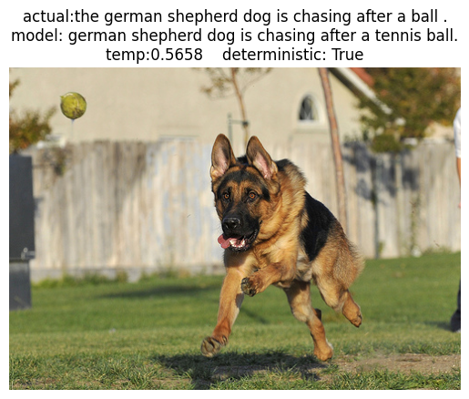

# Image Captioning using ViT and GPT2 architecture

This is my attempt to make a transformer model which takes image as the input and provides a caption for the image

## Model Architecture
It comprises of 12 ViT decoders and 12 GPT2 decoders

## Training
The model was trained on the dataset Flickr30k which comprises of 30k images and 5 captions for each image
The model was trained for 8 epochs (which took 10hrs on kaggle's P100 GPU)

## Results
These are the loss curves.

## Predictions
To predict your own images download the models.py, predict.py and the requirements.txt and then run the following commands->

`pip install -r requirements.txt`

`python predict.py`

*Predicting for the first time will take time as it has to download the model weights (1GB)*

Here are a few examples of the prediction done on the Validation dataset

As we can see these are not the most amazing predictions. The performance could be improved by training it further and using an even bigger dataset like MS COCO (500k captioned images)

## FAQ

Check the [full notebook](./imagecaptioning.ipynb) or [Kaggle](https://www.kaggle.com/code/ayushman72/imagecaptioning)

Download the [weights](https://drive.google.com/file/d/1X51wAI7Bsnrhd2Pa4WUoHIXvvhIcRH7Y/view?usp=drive_link) of the model